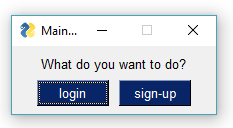
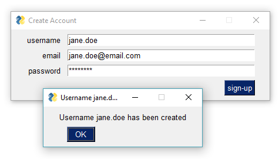
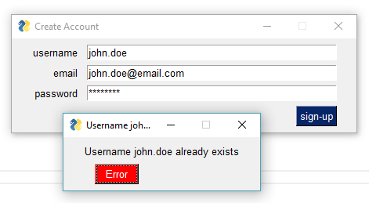
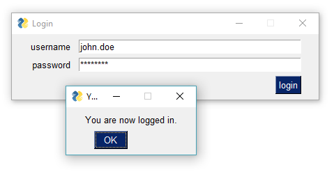
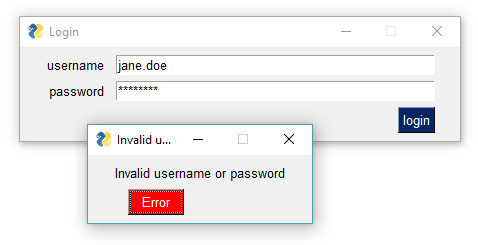

# User-Login-GUI
 User login GUI demonstration with PySimpleGUI. Adapted from an existing tkinter model. See a [live demo](https://repl.it/@IsraelDryer/User-Log-GUI) on repl.it  
 
This application was adapted from a tkinter build by **[i know python](https://www.youtube.com/channel/UCej-wawhhPdjVKihCRk2Ang)**. You can check out his [source code](https://github.com/harshitroy2605/signup-and-login-using-tkinter-gui) and [YouTube](https://www.youtube.com/watch?v=lcBoYduaUy0&feature=youtu.be+) video here. The purpose of this rebuild was to demonstrate how much simpler the application can be built using the PySimpleGUI framework.

I made a few optimizations in this build versus the original application; however, comparing the orignal code base to an exact replica, the **PySimpleGUI** version uses 1,706 characters, while the **tkinter** version uses 2,244 characters, which is **24% fewer characters in total.** 

Check out the screenshots:  
  
  
  
  
  

